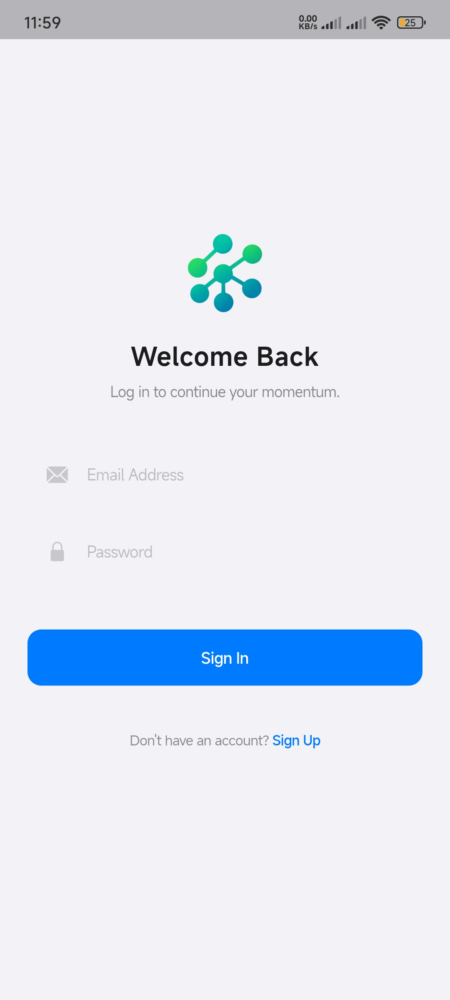
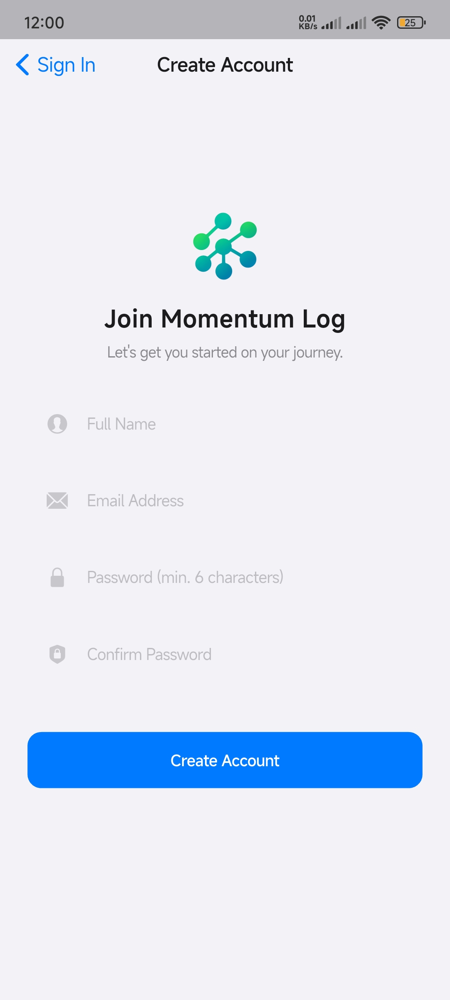
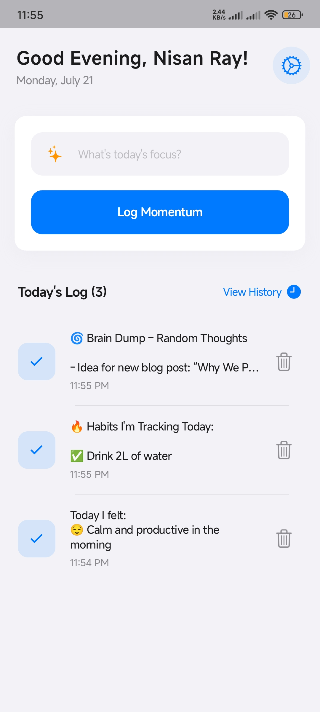
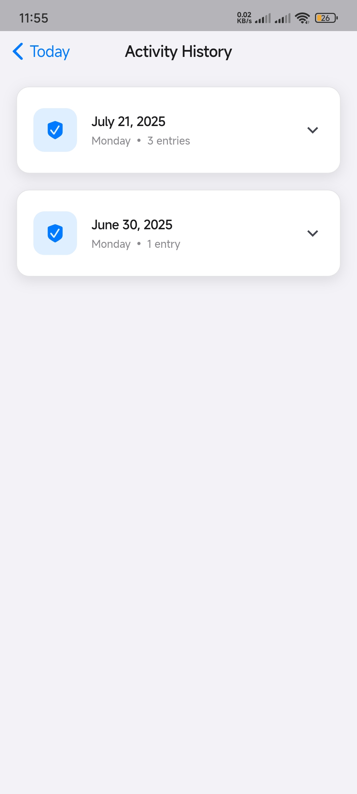
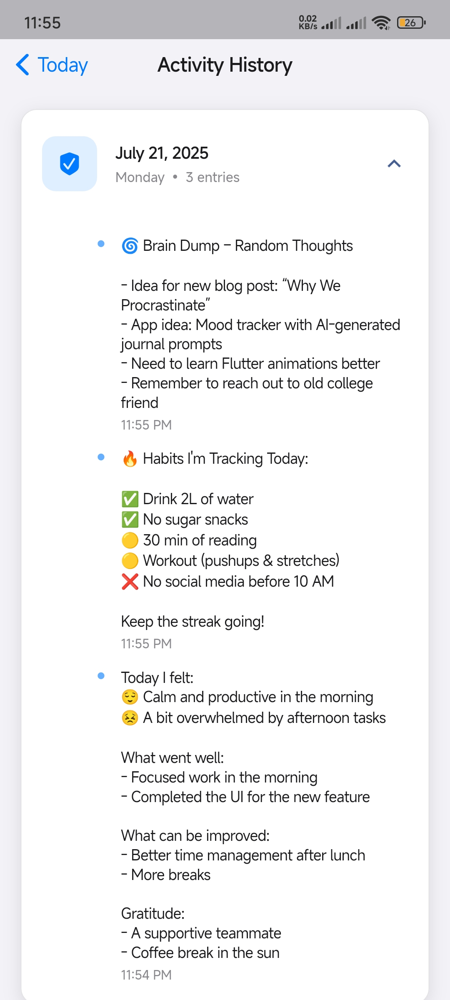

# Activity Tracker (Momentum Log)

Momentum Log is a cross-platform Flutter application for daily activity and task logging. It features a modern, Cupertino-inspired UI, robust offline and online data management, and seamless sync with Firebase. Perfect for personal productivity, habit tracking, or journaling.

---

## ✨ Full Feature List

### Authentication & User Management
- Sign up with email and password (Firebase Auth)
- Secure login/logout
- Persistent user session
- User preferences stored locally (Hive)

### Activity & Task Logging
- Add, edit, and delete daily activities/tasks
- Each activity/task includes a description and timestamp
- Activities are grouped and displayed by day

### Data Storage & Sync
- Offline-first: All data is stored locally using Hive
- Automatic sync with Firestore when online
- Conflict resolution and sync status feedback
- Data is user-specific and securely separated

### Viewing & History
- View all past logs in a history screen, grouped by date
- Expand any day to see detailed activity breakdown
- Edit or delete past entries

### UI/UX
- Modern, Cupertino-inspired design for a clean and intuitive experience
- Responsive layouts for mobile, tablet, and desktop
- Custom widgets for cards, forms, and app logo
- Theming with custom colors and fonts

### Settings & Preferences
- User settings screen for managing account and preferences
- Option to log out and clear user data

### Connectivity
- Connectivity controller to detect online/offline status
- Syncs data automatically when connection is restored

### Platform Support
- Android, iOS, Web, Windows, macOS, Linux (with platform-specific setup)

### Security & Privacy
- User data is isolated and protected
- Local storage uses Hive boxes with unique names per user

### Developer Experience
- Well-structured codebase with clear separation of concerns (controllers, models, views, widgets)
- Easy to extend with new features or screens
- Detailed README with setup and Firebase integration guide
- Screenshots included for quick visual onboarding

---

## 🛠 Tech Stack

- **Flutter** (Dart)
- **Firebase Auth & Firestore**
- **Hive** (local storage)
- **Provider** (state management)
- Platform support: Android, iOS, Web, Windows, macOS, Linux

## 🚀 Getting Started

### 1. Clone the repo
```sh
git clone <repo-url>
cd activity_tracker
```

### 2. Install dependencies
```sh
flutter pub get
```

### 3. Firebase Setup (Required!)

This app uses Firebase for authentication and cloud sync. You must set up your own Firebase project:

#### a. [Create a Firebase project](https://console.firebase.google.com/)
#### b. Add your app (Android/iOS/Web) in the Firebase console
#### c. Download the config files:
   - **Android:** Place `google-services.json` in `android/app/`
   - **iOS:** Place `GoogleService-Info.plist` in `ios/Runner/`
   - **Web:** Update `web/index.html` as needed

#### d. Generate `firebase_options.dart` (REQUIRED)
This file is not included in the repo. Generate it with the [FlutterFire CLI](https://firebase.flutter.dev/docs/cli/):

```sh
dart pub global activate flutterfire_cli
flutterfire configure
```

This will create `lib/firebase_options.dart` with your project’s Firebase config.

> **Note:** If you skip this, the app will not run! See [FlutterFire CLI docs](https://firebase.flutter.dev/docs/cli/) for help.

### 4. Run the app
```sh
flutter run
```

---

## 📁 Folder Structure

- `lib/` — Dart source code
  - `controllers/` — Business logic (auth, activity, connectivity)
  - `models/` — Data models (activity, daily log, user prefs, etc.)
  - `views/` — Screens (login, signup, daily log, settings, etc.)
  - `widgets/` — Reusable UI components
- `assets/` — Images and static assets
- `android/`, `ios/`, `web/`, `windows/`, `macos/`, `linux/` — Platform-specific code


## 🖼 App Screenshots

Experience a clean, modern, and intuitive interface designed for productivity and ease of use. Below are some highlights from the app:

<div align="center">

<table>
  <tr>
    <td align="center">
      
      <br><b>Login</b>
      <br><sub>Securely sign in to access your activity logs and sync across devices.</sub>
    </td>
    <td align="center">
      
      <br><b>Sign Up</b>
      <br><sub>Create a new account in seconds with a simple, elegant form.</sub>
    </td>
  </tr>
  <tr>
    <td align="center">
      
      <br><b>Daily Logging</b>
      <br><sub>Log your daily activities and tasks with a beautiful, distraction-free interface.</sub>
    </td>
    <td align="center">
      
      <br><b>Activity History</b>
      <br><sub>Review your past logs at a glance, grouped by date for easy navigation.</sub>
    </td>
  </tr>
  <tr>
    <td align="center" colspan="2">
      
      <br><b>Expanded History View</b>
      <br><sub>Drill down into any day to see detailed activity breakdowns and edit entries as needed.</sub>
    </td>
  </tr>
</table>

</div>

## 🤝 Contributing

Pull requests are welcome! For major changes, please open an issue first.

## 📄 License

MIT (or specify your license)

---

### Need help?
- [FlutterFire CLI setup guide](https://firebase.flutter.dev/docs/cli/)
- [Flutter documentation](https://docs.flutter.dev/)
- [Firebase documentation](https://firebase.google.com/docs)
